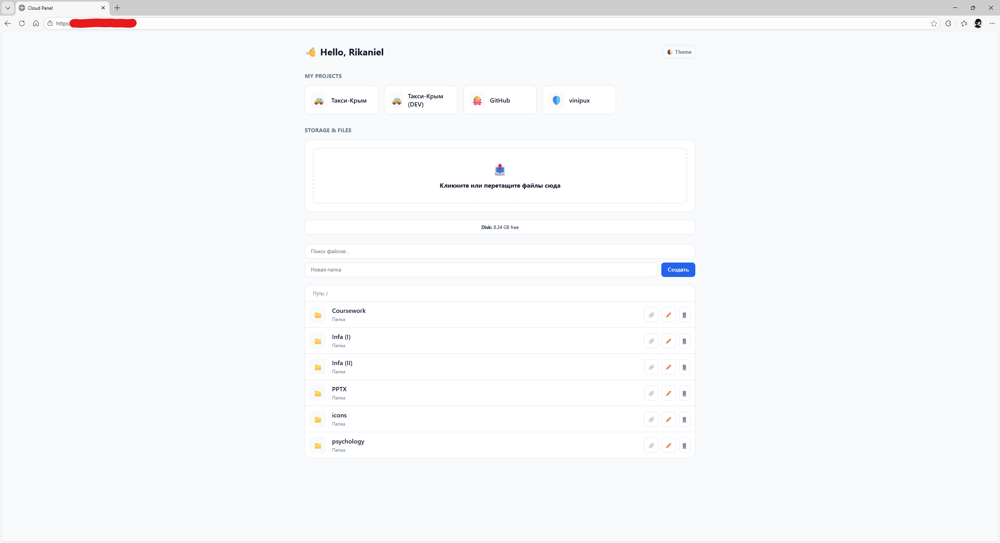

---

# ☁️ Cloud Panel

<p align="center">
  Минималистичная файловая веб-панель на чистом PHP  
  <br>
  Быстро. Легко. Без фреймворков.
</p>

<p align="center">
  
  
  
  
  
</p>

---

## 🚀 О проекте

**Cloud Panel** — это лёгкая веб-панель для управления файлами на сервере и быстрого доступа к вашим проектам.

Без баз данных.
Без фреймворков.
Один PHP-файл — и всё работает.

Подходит для:

* VPS
* Личного сервера
* Пет-проектов
* Мини-облака
* Админ-панели разработчика

---

## ✨ Возможности

### 📁 Файловый менеджер

* 📤 Drag & Drop загрузка
* 📊 Прогресс-бар
* 📂 Создание папок
* ✏️ Переименование (AJAX)
* 🗑 Удаление файлов и папок
* 🔎 Поиск по текущей директории
* 🖼 Предпросмотр изображений
* 🔗 Копирование публичной ссылки
* 💾 Отображение свободного места на диске
* 📁 Навигация по папкам

---

### 🗂 My Projects

Блок быстрых ссылок на проекты:

```php
$myProjects = [
    ["name" => "Project", "url" => "https://example.com", "icon" => "🚀"],
];
```

* Сетка карточек
* Поддержка emoji-иконок
* Открытие в новой вкладке

---

### 🎨 Интерфейс

* 🌙 Тёмная тема
* ☀️ Светлая тема
* 💾 Сохранение темы в localStorage
* 📱 Адаптивный дизайн
* ⚡ Без сторонних библиотек

---

## ⚙️ Установка

1️⃣ Загрузите файл на сервер
2️⃣ Убедитесь, что есть права на папку `files/`
3️⃣ Откройте в браузере

```bash
mkdir files
chmod -R 777 files
```

Готово ✅

---

## 📂 Структура

```
/
 ├── index.php
 └── files/
```

Все файлы хранятся внутри `/files`.

---

## 🔐 Безопасность

Встроено:

* Защита от выхода за пределы `files/`
* Очистка имён папок
* `basename()` при операциях

Рекомендуется дополнительно:

* Добавить авторизацию
* Ограничить типы файлов
* Настроить `.htaccess`
* Ограничить размер загрузки в php.ini

---

## 🛠 Технологии

* PHP 8+
* Vanilla JavaScript
* AJAX (XMLHttpRequest + Fetch)
* CSS Custom Properties

---

## 📸 Скриншот

Добавьте скриншот панели:

```markdown

```

---

## 💡 Roadmap

* 🔐 Авторизация
* 📦 Архивация ZIP
* 📜 Логи действий
* 🧠 Ограничения ролей
* 🌍 API режим
* 🗃 Перетаскивание файлов между папками
* 📊 Статистика использования

---

## 📄 License

MIT License

---

## 👨‍💻 Автор

**Rikaniel**
GitHub: [https://github.com/rikan1el](https://github.com/rikan1el)

---

